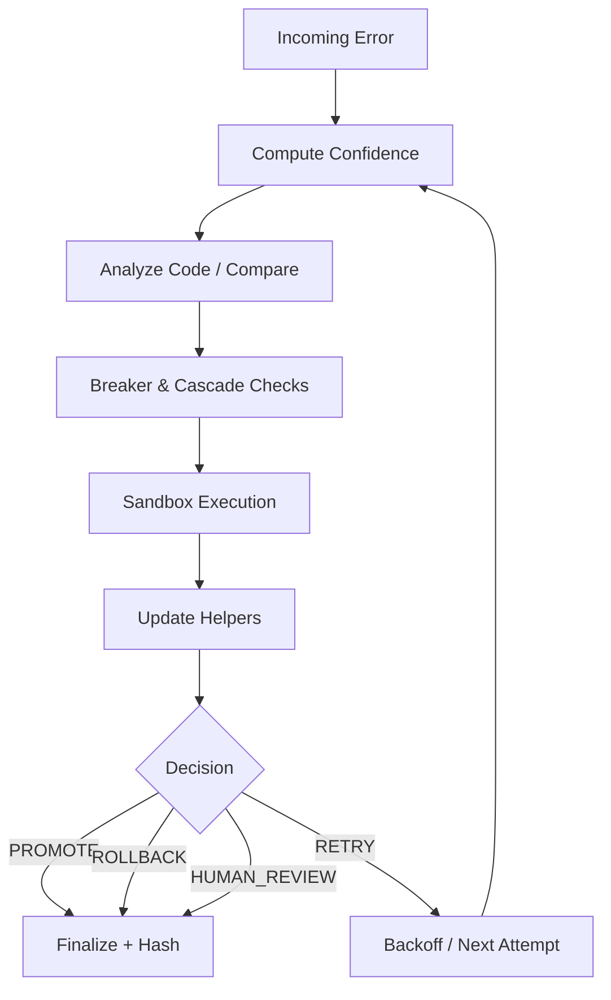

# 🗺️ Debugging as Navigation: The Map & Compass Analogy

> Code Heals Itself is not just *applying* fixes — it's *navigating* toward a stable, higher-quality state.
> Think of the system as **Google Maps for automated debugging**: attempts are waypoints, signals are instruments, and strategy shifts are route recalculations.

---
## 1. Core Idea
Traditional automated debugging is binary: *did it work?* This system exposes a **gradient** of progress so humans **and** LLMs can make informed choices:
- Are we improving?
- Are we wasting attempts?
- Should we pause, escalate, or promote?

---
## 2. Journey vs. Position
| Concept | Analogy | Implementation | Source Helper |
|---------|---------|----------------|---------------|
| Attempt | Lap / waypoint | `attempts[]` | `appendAttempt()` |
| Trend | Direction arrow | `trendMetadata` | `updateTrend()` |
| Confidence | Speedometer cluster | `confidenceComponents` | `mergeConfidence()` |
| Breaker State | Traction / safety control | `breakerState` | `setBreakerState()` |
| Cascade Depth | Gear / recursion level | `cascadeDepth` | `setCascadeDepth()` |
| Resource Usage | Fuel & temp gauges | `resourceUsage` | `mergeResourceUsage()` |
| Risk Flag | Hazard sign | `flagged_for_developer` | `applyDeveloperFlag()` |
| Timeline | Travel log summary | `timeline[]` | `addTimelineEntry()` |
| Counters | Odometer / totals | `counters` | `updateCounters()` |
| Envelope Hash | GPS coordinate / fingerprint | `envelopeHash` | `setEnvelopeHash()` |

---
## 3. Signals (Dashboard Instruments)
**Confidence Components**: Syntax / logic / risk partial scores (0..1).  
**Trend Metadata**: `errorsDetected`, `errorsResolved`, `errorTrend`, `improvementVelocity`, `stagnationRisk`.  
**Breaker State**: `OPEN` / `HALF_OPEN` / `CLOSED` prevents runaway loops.  
**Cascade Depth**: Recursion / adaptive layering safety.  
**Resource Usage**: Observability for cost + anomaly detection.  

---
## 4. Narrative Layers
| Layer | Purpose | Consumer Benefit |
|-------|---------|------------------|
| Attempts | Fine-grain patch evolution | Replay & audit |
| Trend | Direction-of-travel abstraction | Strategy selection |
| Timeline | Coarse summary snapshots | Quick summarization / diff |
| Counters | Budget + progress roll-up | Fast gating / heuristics |
| Hash | Integrity + dedupe | Idempotent storage / caching |

---
## 5. Escalation & Human-in-the-Loop
When `applyDeveloperFlag()` sets a flag (optionally with a reason code):
- The system stops pretending automation alone is safe.
- LLMs can pivot messaging: *"Human review required before promotion."*

Future: Formalize `developer_flag_reason` enum (e.g. `POLICY_RISK`, `WATCHDOG_SEVERITY`, `BUDGET_EXHAUSTED`).

---
## 6. Integrity & Trust
| Mechanism | Role |
|-----------|------|
| Hash (stable canonical subset) | Tamper-evidence & logical identity |
| Timestamp (ISO) | Ordering & TTL anchoring |
| Schema Validation | Enforces shape and contract | 
| Helper Isolation | Minimizes accidental coupling |
| Unit Tests (helpers) | Guardrail against regression |

---
## 7. Flow Overview (Mermaid)

---
## 8. Update Order per Attempt
1. `mergeConfidence()`
2. `updateTrend()`
3. `setBreakerState()`
4. `setCascadeDepth()`
5. `mergeResourceUsage()`
6. `applyDeveloperFlag()` (if risk)
7. `markSuccess()` (if execution succeeded)
8. `setEnvelopeTimestamp()` (finalization phase)
9. `appendAttempt()`
10. `updateCounters()` + `addTimelineEntry()`
11. `setEnvelopeHash()` (last step before emission)

---
## 9. Why LLMs Benefit
LLMs can:
- Detect plateau vs improvement (trend + counters)
- Recommend pause vs retry (breaker + stagnationRisk)
- Summarize rationale to humans (timeline entries)
- Avoid redundant reasoning (stable hash for caching)

This reduces hallucination risk: the model reasons over a curated state vector rather than inferring invisible context.

---
## 10. Extension Principles
| Principle | Rationale |
|-----------|-----------|
| Single Responsibility Helpers | Low blast radius for AI or human edits |
| No Silent Field Mutation | Predictable state evolution |
| Stable Hash Domain | Deterministic identity across runs |
| Schema-First Changes | Prevent drift & broken consumers |
| Additive Evolution | Backward compatibility preserved |

---
## 11. Future Enhancements (Non-Breaking)
- Smoothing window for improvementVelocity
- Formal enum for `developer_flag_reason`
- `attemptType` classification (syntax/logic/other)
- `llm_view` projection (token-thrifty subset)
- Rolling quality delta slope for stagnationRisk
- Timeline action sourced post-decision (final action vs note)

---
## 12. Quick FAQ
**Q: Why not just rely on success?**  
A: Binary success hides partial progress; gradient drives adaptive pacing.

**Q: Why exclude attempts & timestamp from hash?**  
A: To keep logical identity stable while allowing iterative enrichment.

**Q: Can I add a new confidence signal?**  
A: Yes—extend `confidenceComponents`, clamp 0..1, update schema only after adding helper + tests.

---
## 13. Contributor Checklist
- Add/change helper → add/extend unit test
- Run schema validation on a sample envelope
- Confirm hash stability unaffected by volatile fields
- NEVER remove fields without explicit migration plan

---
**Code Heals Itself = Navigation System for Debugging.**  
If traditional systems say *"You are here"*, this system says *"You are here, heading there, at this rate, with these risks."*

---
